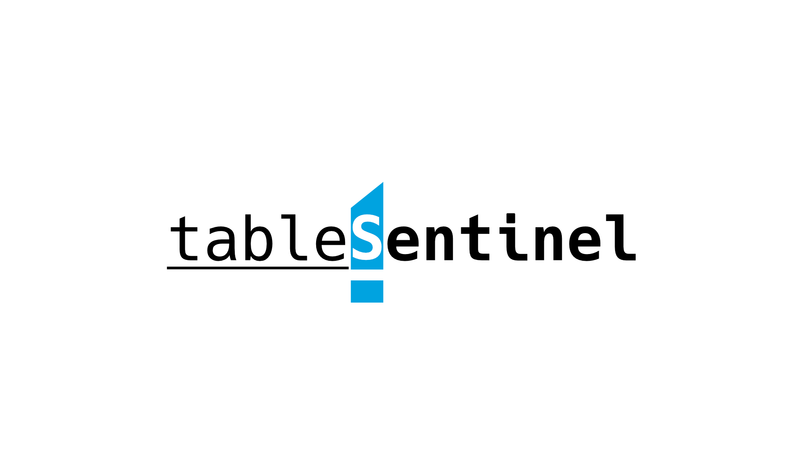

  
  

    <strong>eBPF/XDP + netfilter 기반의 리눅스 방화벽 및 통합 관제 시스템</strong>
  

  
  
  
  
   

---

## 🏗️ Architecture
- **Agent:** Python + XDP (eBPF) for Kernel-level Packet Drop + netfilter (iptables, nftables)
- **Backend:** Spring Boot (REST API, Polling Queue)
- **Frontend:** Vue.js (Dashboard)
- **Infrastructure:** Docker (Privileged Container)

## 🚀 Key Features
- **XDP Native Mode**를 활용한 초고속 패킷 필터링
- **netfilter** 기반 방화벽과 연계로 지능적 패킷 필터링 구현
- **Polling Architecture**로 NAT/Firewall 환경 극복
- **3-Tier Layered Design**으로 확장성 및 유지보수성 확보

## 🛠️ Tech Stack
- **Language:** Python, Java
- **Framework:** Spring Boot, Vue.js
- **Core:** eBPF/XDP, netfilter
- **DevOps:** Docker

## 🎯 Goal
- nftables, xdptool 등 방화벽 유기적 연결
- DB를 통한 유저/로그/감사 관리
- 커널 소스를 통한 호스트 방화벽 실시간 모니터링

---

## TODO (short plan)
 - ☐ 백엔드 및 에이전트 통신 gRPC 리팩터링
 - ☐ 프론트엔드 Test UI → TailAdmin 리팩터링
 - ☑︎ 프로젝트 알파버전 v0.1.0 완성(기능 구현 PoC)
  
## TODO (long plan)
 - ☐ nftables 및 XDP 필터링 지능적 분류
 - ☐ DDoS 의심 패킷 혹은 공격자 패킷 구분 기능 추가

---

# License & Credits
The 'tableSentinel' is released under the MIT License.
See [LICENSE](LICENSE) file for details.

# Third Party Notices
This project uses the following open source software:

## Frontend (Vue.js)
* **Vue.js** (MIT License) - Copyright (c) 2015-present Evan You
* **TailAdmin** (MIT License / Free) - Copyright (c) 2023 TailAdmin
* **Axios** (MIT License)

## Backend (Spring Boot)
* **Spring Boot** (Apache License 2.0)
* **Netty** (Apache License 2.0)
* **gRPC** (Apache License 2.0)

## Agent (Python & Kernel)
* **xdp-tools** (GPL-2.0, LGPL-2.1 and BSD-2-Clause) - *Used via CLI interactions*
* **nftables** (GPL v2) - *Used via CLI interactions*