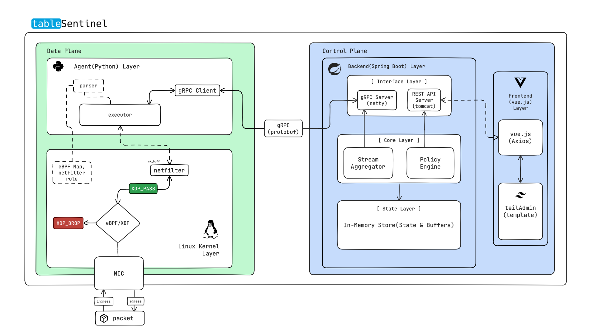

  
  

    <strong>선언적 명세를 활용한 eBPF/XDP + Netfilter 하이브리드 Zero Trust 보안 플랫폼</strong>
  

# tableSentinel project

tableSentinel은 선언형 제어를 통해 망내의 Linux 호스트의 방화벽을 제어하여 Zero Trust 환경을 구성하기 위한 프로젝트입니다.

  

## Poject Design

- eBPF/XDP, netfilter 등 리눅스 네트워크 스택을 제어하여 L2/L3 방화벽 제어
- 선언적 구조를 통해 망내의 호스트 방화벽 규칙의 멱등성 보장을 목표
- gRPC 통신과 mTLS 통신 파이프라인을 통해 보안성 향상과 명세서 암호화를 통한 안전한 규칙 적용

## Caution

현재 프로젝트는 명령형 기반으로 구조적 문제점을 확인하여 명세형 기반 선언형 구조로 전환을 계획하고 있습니다. 전체적인 코드 구조개선과 기존에 작성한 ADR 대규모 변화가 있을 예정입니다.

## Require & Run (예정)

- Agent
  - Rust-Standalone - Linux Kernel >= 5.10 (예정)

- Backend
  - Case.Container -> Docker
  - Case.Standalone - [back-end.Dockerfile](./docker/back-end.Dockerfile), 코드에 기재된 구성요소 필요

- Frontend
  - Case.Container -> Docker
  - Case.Standalone - [front-end.Dockerfile](./docker/front-end.Dockerfile), 코드에 기재된 구성요소 필요

## Plan

### 선언형 기반 v0.3.0(Current) - 2026/02/04

- Agent
  - ☐ Rust 변경 및 구조 개선 (진행중)
  - ☐ BPF/XDP Aya 라이브러리를 이용한 제어
  - ☐ netfilter(iptables, nftables)는 CLI로 제어하여 호환성 및 명세서 처리

- Security
  - ☐ 통신 구간(mTLS) 암호화 및 API 인증 강화
  - ☐ 명세형 기반으로 gRPC byte 변수를 통해 암호화된 방화벽 규칙 적용

- Backend
  - ☐ DB 연결 및 방화벽 제어 사용자/감사/로그 등 구성

- Frontend
  - ☐ 사용자 방화벽 규칙 백엔드 전달 파이프라인 구성

### 명령형 기반 v0.2.0(Checkout) - 2026/01/04

- ☑︎ Core: XDP 및 nftables 기반 차단 로직 구현 (완료)
- ☑︎ Network: 백엔드-에이전트 간 gRPC 스트리밍 통신 구현 (완료)
- ☑︎ UI: Vue.js 기반 대시보드 및 실시간 제어 연동 (완료)

## License & Credits

The tableSentinel is released under the AGPL License.
See [LICENSE](LICENSE) file for details.

### Third Party Notices

This project uses the following open source software:

#### Frontend (Vue.js)

- **Vue.js** (MIT License) - Copyright (c) 2015-present Evan You
- **TailAdmin** (MIT License / Free) - Copyright (c) 2023 TailAdmin
- **Axios** (MIT License)

#### Backend (Spring Boot)

- **Spring Boot** (Apache License 2.0)
- **Netty** (Apache License 2.0)
- **gRPC** (Apache License 2.0)

#### Agent (Python & Kernel)

- **xdp-tools** (GPL-2.0, LGPL-2.1 and BSD-2-Clause) - _Used via CLI interactions_ (제거 예정 및 네이티브 계획)
- **bpftool** (GPL-2.0, LGPL-2.1 and BSD-2-Clause) - _Used via CLI interactions_ (제거 예정 및 네이티브 계획)
- **nftables** (GPL v2) - _Used via CLI interactions_
- **iptables** (GPL v2) - _Used via CLI interactions_
