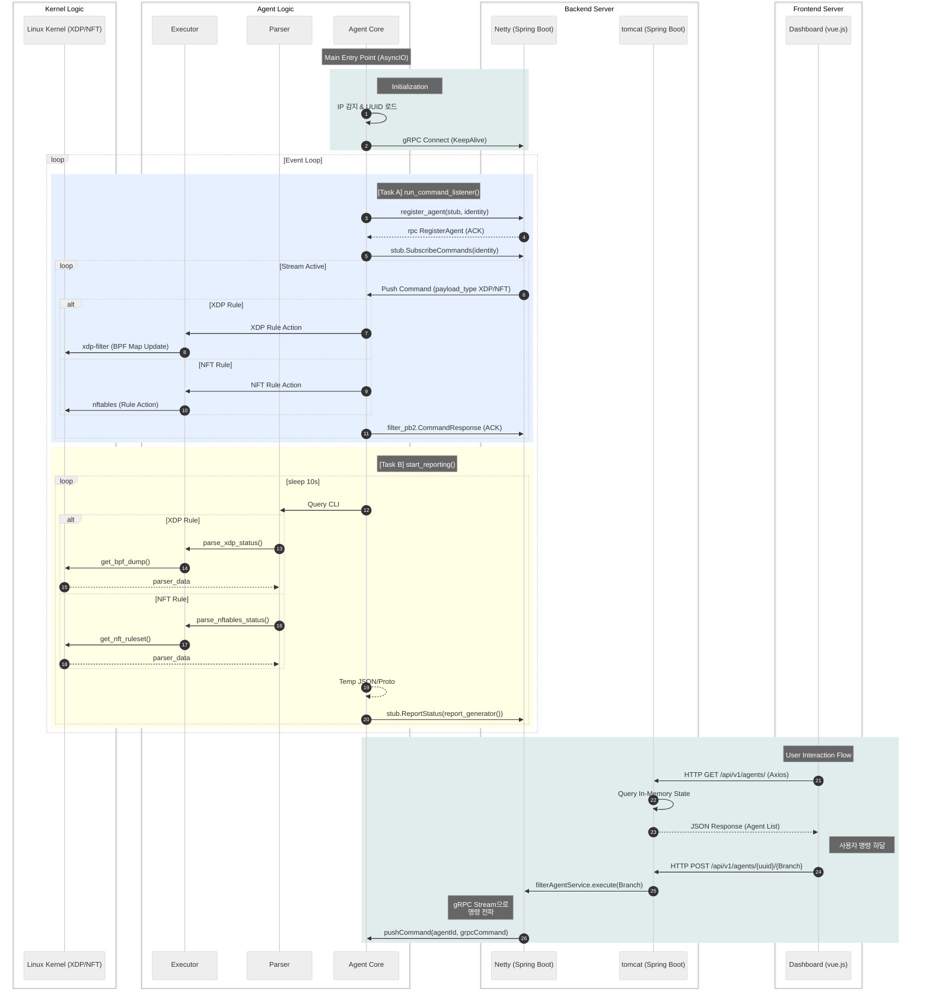

```mermaid
---
config:
  theme: neutral
  themeVariables:
    primaryColor: '#2d2d2d'
    edgeLabelBackground: '#ffffff'
    tertiaryColor: '#f4f4f4'
---
sequenceDiagram
    autonumber
    box Kernel Logic #f9f9f9
        participant Kernel as Linux Kernel (XDP/NFT)
    end
    box Agent Logic #e1f5fe
        participant Exec as Executor
        participant Parser as Parser
        participant Agent as Agent Core
    end
    box Backend Server #fff3e0
        participant Server as Netty (Spring Boot)
        participant Server2 as tomcat (Spring Boot)
    end
    box Frontend Server #fff3e0
        participant Front as Dashboard (vue.js)
    end

    Note over Agent: Main Entry Point (AsyncIO)
    rect rgb(225, 237, 236)
        Note right of Agent: Initialization
        Agent->>Agent: IP 감지 & UUID 로드
        Agent->>Server: gRPC Connect (KeepAlive)
    end

    loop Event Loop
        %% Task 1: listener_task
        rect rgb(230, 240, 255)
            Note right of Agent: [Task A] run_command_listener()
            Agent->>Server: register_agent(stub, identity)
            Server-->>Agent: rpc RegisterAgent (ACK)
            
            Agent->>Server: stub.SubscribeCommands(identity)
            
            loop Stream Active
                Server->>Agent: Push Command (payload_type XDP/NFT)
                alt XDP Rule
                    Agent->>Exec: XDP Rule Action
                    Exec->>Kernel: xdp-filter (BPF Map Update)
                else NFT Rule
                    Agent->>Exec: NFT Rule Action
                    Exec->>Kernel: nftables (Rule Action)
                end
                Agent->>Server: filter_pb2.CommandResponse (ACK)
            end
        end

        %% Task 2: reporter_task
        rect rgb(255, 255, 230)
            Note right of Agent: [Task B] start_reporting()
            loop sleep 10s
                Agent->>Parser: Query CLI
                alt XDP Rule
                    Parser->>Exec: parse_xdp_status()
                    Exec->>Kernel: get_bpf_dump()
                    Kernel-->>Parser: parser_data
                else NFT Rule
                    Parser->>Exec: parse_nftables_status()
                    Exec->>Kernel: get_nft_ruleset()
                    Kernel-->>Parser: parser_data
                end
                Agent-->>Agent: Temp JSON/Proto
                Agent->>Server: stub.ReportStatus(report_generator())
            end
        end
    end

    %% View
    rect rgb(225, 237, 236)
        Note over Front: User Interaction Flow
        Front->>Server2: HTTP GET /api/v1/agents/ (Axios)
        Server2->>Server2: Query In-Memory State
        Server2-->>Front: JSON Response (Agent List)
        
        Note right of Front: 사용자 명령 하달
        Front->>Server2: HTTP POST /api/v1/agents/{uuid}/{Branch}
        Server2->>Server: filterAgentService.execute(Branch)
        Note left of Server: gRPC Stream으로<br/>명령 전파
        Server->>Agent: pushCommand(agentId, grpcCommand)
    end
```